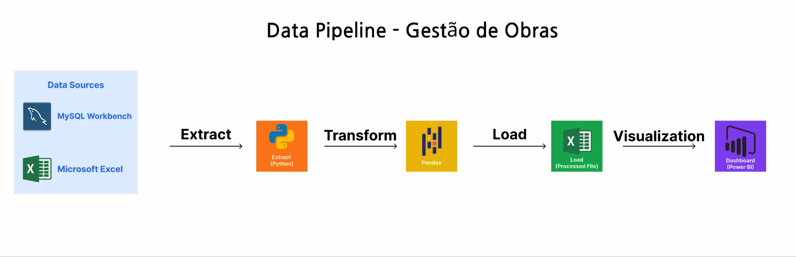

# Pipeline de Dados para Gestão de Obras 

Projeto de construção de um pipeline de dados para automação e análise de obras, integrando Python, SQL e Power BI para geração de insights e acompanhamento gerencial.

# Objetivos: 

- Automatizar o tratamento de dados de obras
- Construir um pipeline de ETL para padronização das informações
- Disponibilizar dashboards interativos para análise gerencial

## Tecnologias utilizadas: 

- Python (Pandas)
- MySQL
- Excel
- Power BI

## Arquitetura do Projeto

O fluxo de dados segue o seguinte processo:

Excel (Base - Empreendimento)
        ↓
Python (ETL com Pandas)
        ↓
Base Tratada
        ↓
Power BI (Dashboard)  

## Funcionamento do projeto: 

1. Leitura da planilha base por Pandas.
2. Tratamento e filtragem de dados com Python (ETL).
3. Armazenamento dos dados tratados para análise
4. Visualização no Power BI.

## Estrutura do projeto: 

- data/: dados brutos e tratados.
- src/: scripts de automação.
- dashboards/: arquivos do Power BI.

## Como executar

1. Clone o repositório:
git clone https://github.com/seu-usuario/seu-repo

2. Instale as dependências:
pip install pandas 
pip install openpyxl

4. Execute o script:
python src/etl.py

## Resultados:

- Automatização de processos
- Redução de erros
- Controle do histórico de dados
- Dashboard atualizado automaticamente

## Melhorias futuras

- Deploy do pipeline em ambiente cloud (AWS)
- Automação do processo via agendamento (scheduler)
- Integração com banco de dados relacional
- Criação de API para consumo dos dados
