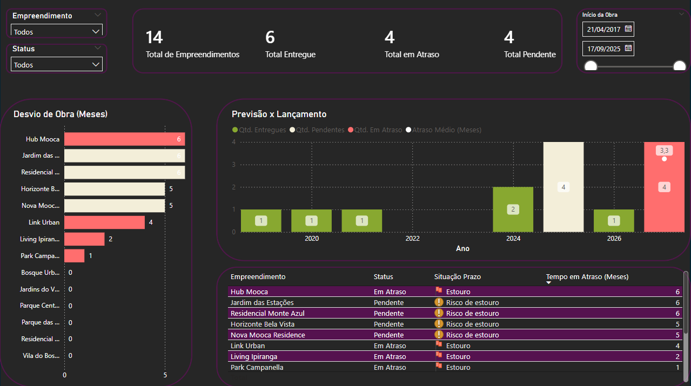

# Pipeline de Dados para Gestão de Obras

Projeto de engenharia e análise de dados com foco em automação de processos e geração de insights.

## Tecnologias utilizadas

- Excel (fonte de dados)
- Python (Pandas, Pathlib)
- MySQL (armazenamento - em evolução)
- Power BI (visualização)

---

## Objetivo

- Automatizar o tratamento de dados de obras  
- Construir um pipeline de ETL para padronização das informações  
- Disponibilizar dashboards interativos para análise gerencial  

---

## Arquitetura do Pipeline

Excel → Python → MySQL → Power BI  

---

## Dashboard

**Principais análises:**
- Acompanhamento de prazos  
- Identificação de atrasos  
- Visão geral dos empreendimentos  

---

## Pipeline de Dados

**Etapas do processo:**

1. Leitura dos dados a partir do Excel  
2. Tratamento e padronização com Python  
3. Geração de base tratada  
4. Consumo dos dados no Power BI  

---

## Regras de Negócio

- Cálculo de atraso em meses com base na data prevista  
- Classificação das obras em:  
  - No prazo  
  - Em risco  
  - Em atraso  

---

## Diferenciais

- Pipeline ETL estruturado  
- Automação do tratamento de dados  
- Aplicação de regras de negócio  
- Integração entre Excel, Python e Power BI  

---

## Estrutura do Projeto

├── data/
├── src/
├── sql/
├── powerbi/
└── README.md

---

## Como executar

1. Atualizar o arquivo Excel  
2. Rodar o script Python  
3. Atualizar o Power BI  

---

## Resultados

- Automatização de processos  
- Redução de erros  
- Controle do histórico de dados  
- Dashboard atualizado automaticamente  

---

## Melhorias futuras

- Deploy do pipeline em ambiente cloud (AWS)  
- Automação via agendamento (scheduler)  
- Integração completa com banco de dados relacional  
- Criação de API para consumo dos dados  
